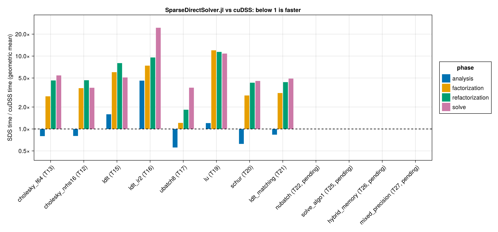

# cuDSS vs SparseDirectSolver.jl

Generated by `bench/compare_report.jl` from `bench/comparison/{cudss,sds}.csv` (`bench/compare.jl`). Times are BenchmarkTools medians per phase on a fresh solver; the ratio is SDS time / cuDSS time, so below 1 means SparseDirectSolver.jl is faster. Features whose task is not done in TASKS.md have blank SDS cells.

## Overview

Geometric mean of the SDS/cuDSS ratio over the matrices both solvers ran.

| feature | task | status | matrices | analysis | factorization | refactorization | solve |
| --- | --- | --- | --- | --- | --- | --- | --- |
| Cholesky, Float64 | T13 | done | 16 | 0.80× | 2.81× | 4.63× | 5.43× |
| Cholesky, 16 right-hand sides | T12 | done | 16 | 0.80× | 3.63× | 4.66× | 3.68× |
| LDLᵀ, static pivoting | T15 | done | 27 | 1.59× | 6.01× | 8.01× | 5.09× |
| LDLᵀ + 2 refinement steps, K2 dumps | T16 | done | 11 | 4.60× | 7.39× | 9.57× | 24.47× |
| Uniform batch of 8, Cholesky | T17 | done | 11 | 0.56× | 1.21× | 1.84× | 3.69× |
| LU, unsymmetric | T19 | done | 2 | 1.20× | 11.99× | 11.41× | 10.83× |
| Schur complement, Cholesky | T20 | done | 11 | 0.62× | 2.88× | 4.31× | 4.56× |
| LDLᵀ + matching (algo5), K2 dumps | T21 | done | 11 | 0.84× | 3.11× | 4.39× | 4.91× |
| Non-uniform batch, condensed dumps | T22 | pending |  |  |  |  |  |
| Partitioned-inverse solve (SDS algo1, cuDSS default) | T25 | pending |  |  |  |  |  |
| Hybrid memory mode | T26 | pending |  |  |  |  |  |
| Float32 factors, Float64 refinement | T27 | pending |  |  |  |  |  |

## Cholesky, Float64

`cholesky_f64`, T13 (done), structure `SPD`, Float64, nrhs = 1.

| matrix | n | analysis cuDSS ms | SDS ms | ratio | factorization cuDSS ms | SDS ms | ratio | refactorization cuDSS ms | SDS ms | ratio | solve cuDSS ms | SDS ms | ratio | nnz(L) cuDSS | SDS | relres cuDSS | SDS |
| --- | --- | --- | --- | --- | --- | --- | --- | --- | --- | --- | --- | --- | --- | --- | --- | --- | --- |
| Boeing/bcsstk38 | 8032 | 65 | 121 | 1.85× | 3.1 | 27.4 | 8.84× | 2.81 | 27.4 | 9.75× | 0.642 | 2.67 | 4.16× | 7.99e+05 | 8.05e+05 | 2.14e-10 | 9.26e-11 |
| GHS_psdef/apache2 | 715176 | 7.71e+03 | 1.32e+04 | 1.71× | 265 | 763 | 2.88× | 264 | 752 | 2.85× | 9.94 | 86.8 | 8.73× | 1.45e+08 | 1.29e+08 | 1.79e-10 | 1.57e-10 |
| HB/bcsstk17 | 10974 | 73.4 | 151 | 2.06× | 4.27 | 30.7 | 7.19× | 2.91 | 30.7 | 10.55× | 0.67 | 4.95 | 7.38× | 1.08e+06 | 1.04e+06 | 3.91e-11 | 3.88e-11 |
| kkt_pglib_opf_case118_ieee_condensed_1 | 1088 | 19.9 | 10.6 | 0.53× | 0.848 | 1.16 | 1.36× | 0.315 | 1.14 | 3.62× | 0.227 | 1.28 | 5.64× | 1.52e+04 | 1.16e+04 | 3.64e-05 | 5.22e-05 |
| kkt_pglib_opf_case118_ieee_condensed_10 | 1088 | 19.9 | 10.6 | 0.53× | 3.17 | 1.15 | 0.36× | 0.314 | 1.13 | 3.60× | 0.225 | 1.35 | 5.99× | 1.52e+04 | 1.16e+04 | 1.38e-05 | 1.12e-05 |
| kkt_pglib_opf_case118_ieee_condensed_20 | 1088 | 19.9 | 10.8 | 0.54× | 0.623 | 1.14 | 1.82× | 0.316 | 1.13 | 3.57× | 0.226 | 1.27 | 5.62× | 1.52e+04 | 1.16e+04 | 0.0466 | 0.0455 |
| kkt_pglib_opf_case1354_pegase_condensed_1 | 11192 | 98.1 | 121 | 1.24× | 3.31 | 3.89 | 1.18× | 0.78 | 3.86 | 4.95× | 0.332 | 1.71 | 5.15× | 1.55e+05 | 1.21e+05 | 0.000312 | 0.00028 |
| kkt_pglib_opf_case1354_pegase_condensed_10 | 11192 | 98.1 | 121 | 1.23× | 3.26 | 3.87 | 1.19× | 0.778 | 3.83 | 4.93× | 0.328 | 1.63 | 4.95× | 1.55e+05 | 1.21e+05 | 0.000144 | 9.67e-05 |
| kkt_pglib_opf_case1354_pegase_condensed_20 | 11192 | 98.4 | 122 | 1.24× | 1.11 | 3.85 | 3.47× | 0.785 | 3.84 | 4.89× | 0.323 | 1.76 | 5.45× | 1.55e+05 | 1.21e+05 | 7.72e-05 | 5.03e-05 |
| kkt_pglib_opf_case14_ieee_condensed_1 | 118 | 10.8 | 1.37 | 0.13× | 0.184 | 0.409 | 2.23× | 0.166 | 0.414 | 2.50× | 0.139 | 0.65 | 4.68× | 1.27e+03 | 1.03e+03 | 1.13e-06 | 1.3e-06 |
| kkt_pglib_opf_case14_ieee_condensed_10 | 118 | 10.8 | 1.4 | 0.13× | 0.186 | 0.415 | 2.24× | 0.165 | 0.4 | 2.42× | 0.138 | 0.664 | 4.82× | 1.27e+03 | 1.03e+03 | 4.27e-05 | 7.85e-05 |
| kkt_pglib_opf_case14_ieee_condensed_11 | 118 | 10.8 | 1.39 | 0.13× | 0.186 | 0.401 | 2.16× | 0.167 | 0.384 | 2.30× | 0.139 | 0.661 | 4.76× | 1.27e+03 | 1.03e+03 | 9.6e-06 | 9.57e-06 |
| kkt_pglib_opf_case78484_epigrids_condensed_1 | 674562 | 6.57e+03 | 1.14e+04 | 1.73× | 24.9 | 167 | 6.71× | 24.5 | 167 | 6.82× | 3.79 | 18.3 | 4.82× | 1.56e+07 | 1.32e+07 | 0.153 | 0.141 |
| kkt_pglib_opf_case78484_epigrids_condensed_10 | 674562 | 6.56e+03 | 1.16e+04 | 1.76× | 24.8 | 167 | 6.73× | 24.4 | 167 | 6.82× | 3.79 | 18.2 | 4.82× | 1.56e+07 | 1.32e+07 | 0.0176 | 0.0147 |
| lap2d_300 | 90000 | 512 | 787 | 1.54× | 6.06 | 33.7 | 5.56× | 5.53 | 33.6 | 6.09× | 1.14 | 5.12 | 4.51× | 2.43e+06 | 2.47e+06 | 1.84e-12 | 1.76e-12 |
| lap3d_40 | 64000 | 637 | 904 | 1.42× | 44.3 | 303 | 6.83× | 43.2 | 303 | 7.01× | 2.44 | 17.5 | 7.17× | 1.75e+07 | 1.44e+07 | 8.21e-14 | 7.33e-14 |

## Cholesky, 16 right-hand sides

`cholesky_nrhs16`, T12 (done), structure `SPD`, Float64, nrhs = 16.

| matrix | n | analysis cuDSS ms | SDS ms | ratio | factorization cuDSS ms | SDS ms | ratio | refactorization cuDSS ms | SDS ms | ratio | solve cuDSS ms | SDS ms | ratio | nnz(L) cuDSS | SDS | relres cuDSS | SDS |
| --- | --- | --- | --- | --- | --- | --- | --- | --- | --- | --- | --- | --- | --- | --- | --- | --- | --- |
| Boeing/bcsstk38 | 8032 | 61.5 | 120 | 1.95× | 3.12 | 27.4 | 8.77× | 2.81 | 27.4 | 9.72× | 0.888 | 3.23 | 3.63× | 7.99e+05 | 8.05e+05 | 7.31e-10 | 1.72e-10 |
| GHS_psdef/apache2 | 715176 | 7.67e+03 | 1.31e+04 | 1.71× | 265 | 750 | 2.83× | 264 | 751 | 2.84× | 43.9 | 176 | 4.00× | 1.45e+08 | 1.29e+08 | 1.82e-10 | 1.53e-10 |
| HB/bcsstk17 | 10974 | 74.1 | 151 | 2.03× | 3.21 | 30.7 | 9.57× | 2.91 | 30.7 | 10.55× | 0.967 | 5.86 | 6.05× | 1.08e+06 | 1.04e+06 | 4.57e-11 | 5.57e-11 |
| kkt_pglib_opf_case118_ieee_condensed_1 | 1088 | 19.9 | 10.6 | 0.53× | 0.858 | 1.16 | 1.35× | 0.319 | 1.14 | 3.58× | 0.308 | 1.36 | 4.42× | 1.52e+04 | 1.16e+04 | 5.34e-05 | 0.000108 |
| kkt_pglib_opf_case118_ieee_condensed_10 | 1088 | 19.9 | 10.6 | 0.53× | 0.616 | 1.14 | 1.85× | 0.322 | 1.13 | 3.51× | 0.307 | 1.38 | 4.51× | 1.52e+04 | 1.16e+04 | 1.48e-05 | 1.69e-05 |
| kkt_pglib_opf_case118_ieee_condensed_20 | 1088 | 19.9 | 10.7 | 0.54× | 0.624 | 1.15 | 1.84× | 0.316 | 1.13 | 3.58× | 0.306 | 1.37 | 4.47× | 1.52e+04 | 1.16e+04 | 0.108 | 0.0835 |
| kkt_pglib_opf_case1354_pegase_condensed_1 | 11192 | 101 | 121 | 1.20× | 1.09 | 3.9 | 3.57× | 0.771 | 3.86 | 5.01× | 0.612 | 1.89 | 3.08× | 1.55e+05 | 1.21e+05 | 0.000392 | 0.000291 |
| kkt_pglib_opf_case1354_pegase_condensed_10 | 11192 | 97.9 | 121 | 1.23× | 1.09 | 3.88 | 3.56× | 0.774 | 3.84 | 4.96× | 0.609 | 1.89 | 3.10× | 1.55e+05 | 1.21e+05 | 0.000152 | 0.000114 |
| kkt_pglib_opf_case1354_pegase_condensed_20 | 11192 | 103 | 124 | 1.21× | 1.09 | 3.87 | 3.54× | 0.767 | 3.84 | 5.01× | 0.609 | 1.9 | 3.11× | 1.55e+05 | 1.21e+05 | 0.000101 | 6.47e-05 |
| kkt_pglib_opf_case14_ieee_condensed_1 | 118 | 10.8 | 1.38 | 0.13× | 0.187 | 0.418 | 2.24× | 0.165 | 0.417 | 2.52× | 0.16 | 0.708 | 4.42× | 1.27e+03 | 1.03e+03 | 1.18e-06 | 1.47e-06 |
| kkt_pglib_opf_case14_ieee_condensed_10 | 118 | 10.8 | 1.39 | 0.13× | 0.187 | 0.42 | 2.24× | 0.167 | 0.419 | 2.51× | 0.164 | 0.706 | 4.30× | 1.27e+03 | 1.03e+03 | 6.75e-05 | 0.000143 |
| kkt_pglib_opf_case14_ieee_condensed_11 | 118 | 10.8 | 1.46 | 0.14× | 0.187 | 0.407 | 2.17× | 0.169 | 0.403 | 2.39× | 0.157 | 0.711 | 4.52× | 1.27e+03 | 1.03e+03 | 4.36e-05 | 2.29e-05 |
| kkt_pglib_opf_case78484_epigrids_condensed_1 | 674562 | 6.56e+03 | 1.19e+04 | 1.81× | 24.9 | 167 | 6.71× | 24.5 | 167 | 6.84× | 21.7 | 51.7 | 2.38× | 1.56e+07 | 1.32e+07 | 0.185 | 0.175 |
| kkt_pglib_opf_case78484_epigrids_condensed_10 | 674562 | 6.55e+03 | 1.17e+04 | 1.79× | 25.2 | 167 | 6.62× | 24.4 | 167 | 6.84× | 21.7 | 51.7 | 2.38× | 1.56e+07 | 1.32e+07 | 0.0178 | 0.0148 |
| lap2d_300 | 90000 | 510 | 787 | 1.55× | 6.08 | 33.6 | 5.53× | 5.51 | 33.6 | 6.11× | 4.23 | 9.99 | 2.36× | 2.43e+06 | 2.47e+06 | 1.85e-12 | 1.76e-12 |
| lap3d_40 | 64000 | 633 | 904 | 1.43× | 43.7 | 303 | 6.93× | 42.9 | 303 | 7.06× | 5.54 | 22.9 | 4.14× | 1.75e+07 | 1.44e+07 | 8.92e-14 | 6.39e-14 |

## LDLᵀ, static pivoting

`ldlt`, T15 (done), structure `S`, Float64, nrhs = 1.

| matrix | n | analysis cuDSS ms | SDS ms | ratio | factorization cuDSS ms | SDS ms | ratio | refactorization cuDSS ms | SDS ms | ratio | solve cuDSS ms | SDS ms | ratio | nnz(L) cuDSS | SDS | relres cuDSS | SDS |
| --- | --- | --- | --- | --- | --- | --- | --- | --- | --- | --- | --- | --- | --- | --- | --- | --- | --- |
| Boeing/bcsstk38 | 8032 | 68 | 139 | 2.05× | 5.39 | 47.1 | 8.75× | 3.72 | 47.1 | 12.66× | 0.675 | 2.79 | 4.14× | 7.99e+05 | 8.05e+05 | 7.1e-11 | 1.77e-10 |
| GHS_psdef/apache2 | 715176 | 7.69e+03 | 1.33e+04 | 1.73× | 314 | 1.88e+03 | 5.99× | 313 | 1.87e+03 | 5.98× | 13.2 | 108 | 8.18× | 1.45e+08 | 1.29e+08 | 1.57e-10 | 1.42e-10 |
| HB/bcsstk17 | 10974 | 76 | 169 | 2.22× | 4.1 | 56.6 | 13.81× | 3.8 | 56.5 | 14.88× | 0.702 | 5.18 | 7.38× | 1.08e+06 | 1.04e+06 | 3.62e-11 | 4.16e-11 |
| kkt_pglib_opf_case118_ieee_condensed_1 | 1088 | 24.8 | 11.4 | 0.46× | 0.758 | 2.67 | 3.53× | 0.476 | 2.65 | 5.57× | 0.342 | 1.28 | 3.75× | 1.52e+04 | 1.16e+04 | 5.35e-05 | 0.000111 |
| kkt_pglib_opf_case118_ieee_condensed_10 | 1088 | 24.7 | 11.4 | 0.46× | 1.25 | 2.6 | 2.08× | 0.484 | 2.56 | 5.30× | 0.334 | 1.37 | 4.10× | 1.52e+04 | 1.16e+04 | 1.18e-05 | 1.01e-05 |
| kkt_pglib_opf_case118_ieee_condensed_20 | 1088 | 24.8 | 11.4 | 0.46× | 0.724 | 2.67 | 3.69× | 0.475 | 2.64 | 5.56× | 0.336 | 1.3 | 3.87× | 1.52e+04 | 1.16e+04 | 0.0353 | 0.0365 |
| kkt_pglib_opf_case118_ieee_k2_1 | 3185 | 27.9 | 134 | 4.80× | 0.901 | 2.66 | 2.95× | 0.367 | 2.63 | 7.18× | 0.221 | 1.58 | 7.13× | 2e+04 | 2.11e+04 | 3.8 | 1.05 |
| kkt_pglib_opf_case118_ieee_k2_10 | 3185 | 27.9 | 137 | 4.93× | 0.675 | 2.59 | 3.84× | 0.353 | 2.56 | 7.26× | 0.222 | 1.61 | 7.27× | 2e+04 | 2.06e+04 | 7.08 | 0.00737 |
| kkt_pglib_opf_case118_ieee_k2_20 | 3185 | 27.9 | 134 | 4.81× | 2.12 | 2.56 | 1.21× | 0.356 | 2.53 | 7.10× | 0.223 | 1.56 | 7.01× | 2e+04 | 2.06e+04 | 12.6 | 0.0238 |
| kkt_pglib_opf_case1354_pegase_condensed_1 | 11192 | 101 | 127 | 1.26× | 1.26 | 10.3 | 8.17× | 0.956 | 10.2 | 10.70× | 0.335 | 1.71 | 5.11× | 1.55e+05 | 1.21e+05 | 0.000291 | 0.000313 |
| kkt_pglib_opf_case1354_pegase_condensed_10 | 11192 | 102 | 128 | 1.26× | 1.26 | 10.4 | 8.23× | 0.951 | 10.4 | 10.90× | 0.334 | 1.77 | 5.31× | 1.55e+05 | 1.21e+05 | 0.000146 | 0.00011 |
| kkt_pglib_opf_case1354_pegase_condensed_20 | 11192 | 99.7 | 128 | 1.29× | 1.26 | 10.4 | 8.27× | 0.935 | 10.4 | 11.11× | 0.337 | 1.73 | 5.13× | 1.55e+05 | 1.21e+05 | 6.73e-05 | 5.62e-05 |
| kkt_pglib_opf_case1354_pegase_k2_1 | 33811 | 193 | 2.3e+03 | 11.90× | 1.99 | 10.4 | 5.22× | 1.37 | 10.3 | 7.50× | 0.444 | 2.35 | 5.30× | 2.02e+05 | 2.16e+05 | 91.7 | 16.9 |
| kkt_pglib_opf_case1354_pegase_k2_10 | 33811 | 195 | 2.37e+03 | 12.18× | 1.66 | 9.47 | 5.72× | 1.37 | 9.44 | 6.90× | 0.442 | 2.19 | 4.95× | 2.02e+05 | 2.2e+05 | 56.3 | 29.6 |
| kkt_pglib_opf_case1354_pegase_k2_20 | 33811 | 192 | 2.39e+03 | 12.41× | 1.7 | 10.1 | 5.97× | 1.37 | 10.1 | 7.36× | 0.545 | 2.22 | 4.07× | 2.02e+05 | 2.21e+05 | 1.16e+03 | 27.5 |
| kkt_pglib_opf_case14_ieee_condensed_1 | 118 | 13.8 | 1.53 | 0.11× | 0.284 | 0.632 | 2.22× | 0.289 | 0.628 | 2.17× | 0.248 | 0.696 | 2.81× | 1.27e+03 | 1.03e+03 | 1.07e-06 | 8.58e-07 |
| kkt_pglib_opf_case14_ieee_condensed_10 | 118 | 13.8 | 1.51 | 0.11× | 0.29 | 0.637 | 2.19× | 0.287 | 0.632 | 2.20× | 0.246 | 0.692 | 2.81× | 1.27e+03 | 1.03e+03 | 3.42e-05 | 1.82e-05 |
| kkt_pglib_opf_case14_ieee_condensed_11 | 118 | 13.8 | 1.51 | 0.11× | 0.296 | 0.641 | 2.17× | 0.283 | 0.638 | 2.25× | 0.25 | 0.669 | 2.68× | 1.27e+03 | 1.03e+03 | 1.04e-05 | 7.29e-06 |
| kkt_pglib_opf_case14_ieee_k2_1 | 347 | 15.5 | 7.26 | 0.47× | 0.313 | 0.957 | 3.06× | 0.302 | 0.96 | 3.18× | 0.269 | 1.03 | 3.83× | 2.05e+03 | 2.15e+03 | 0.518 | 7.57e-08 |
| kkt_pglib_opf_case14_ieee_k2_10 | 347 | 15.5 | 7.23 | 0.47× | 0.197 | 0.965 | 4.91× | 0.177 | 0.952 | 5.38× | 0.154 | 0.977 | 6.34× | 2.05e+03 | 2.16e+03 | 0.409 | 4.36e-05 |
| kkt_pglib_opf_case14_ieee_k2_15 | 347 | 12 | 5.62 | 0.47× | 0.197 | 1.58 | 8.02× | 0.185 | 1.57 | 8.47× | 0.152 | 1.13 | 7.41× | 2.05e+03 | 3.23e+03 | 0.698 | 0.123 |
| kkt_pglib_opf_case78484_epigrids_condensed_1 | 674562 | 6.55e+03 | 1.21e+04 | 1.85× | 30.8 | 535 | 17.36× | 30.3 | 535 | 17.62× | 4.1 | 20.1 | 4.90× | 1.56e+07 | 1.32e+07 | 0.165 | 0.114 |
| kkt_pglib_opf_case78484_epigrids_condensed_10 | 674562 | 6.59e+03 | 1.14e+04 | 1.72× | 39.2 | 510 | 13.01× | 29.8 | 509 | 17.10× | 4.1 | 20.2 | 4.92× | 1.56e+07 | 1.32e+07 | 0.0168 | 0.0121 |
| kkt_pglib_opf_case78484_epigrids_k2_1 | 2091669 | 2.01e+04 | 5.44e+05 | 27.03× | 48.1 | 2.29e+03 | 47.68× | 47.4 | 2.26e+03 | 47.70× | 13.3 | 81.3 | 6.12× | 1.85e+07 | 2.77e+07 | 6.46e+09 | 1.9e+04 |
| kkt_pglib_opf_case78484_epigrids_k2_10 | 2091669 | 2.02e+04 | 5.69e+05 | 28.16× | 49.9 | 2.25e+03 | 45.05× | 46.7 | 2.23e+03 | 47.73× | 13.3 | 79 | 5.94× | 1.85e+07 | 2.7e+07 | 2.55e+04 | 8.08e+03 |
| lap2d_300 | 90000 | 478 | 807 | 1.69× | 7.38 | 50 | 6.77× | 7.02 | 49.9 | 7.11× | 1.21 | 5.94 | 4.92× | 2.43e+06 | 2.47e+06 | 1.61e-12 | 1.58e-12 |
| lap3d_40 | 64000 | 610 | 925 | 1.52× | 53 | 515 | 9.72× | 52.9 | 515 | 9.73× | 2.53 | 23.2 | 9.19× | 1.75e+07 | 1.44e+07 | 7.58e-14 | 6.27e-14 |

## LDLᵀ + 2 refinement steps, K2 dumps

`ldlt_ir2`, T16 (done), structure `S`, Float64, nrhs = 1.

| matrix | n | analysis cuDSS ms | SDS ms | ratio | factorization cuDSS ms | SDS ms | ratio | refactorization cuDSS ms | SDS ms | ratio | solve cuDSS ms | SDS ms | ratio | nnz(L) cuDSS | SDS | relres cuDSS | SDS |
| --- | --- | --- | --- | --- | --- | --- | --- | --- | --- | --- | --- | --- | --- | --- | --- | --- | --- |
| kkt_pglib_opf_case118_ieee_k2_1 | 3185 | 28.9 | 133 | 4.59× | 0.664 | 2.63 | 3.96× | 0.357 | 2.59 | 7.26× | 0.489 | 7.54 | 15.44× | 2e+04 | 2.11e+04 | 0.000464 | 1.72e-08 |
| kkt_pglib_opf_case118_ieee_k2_10 | 3185 | 27.8 | 138 | 4.94× | 0.67 | 2.55 | 3.81× | 0.359 | 2.52 | 7.03× | 0.487 | 7.4 | 15.19× | 2e+04 | 2.06e+04 | 0.228 | 6.76e-10 |
| kkt_pglib_opf_case118_ieee_k2_20 | 3185 | 27.9 | 132 | 4.75× | 0.676 | 2.52 | 3.73× | 0.362 | 2.48 | 6.86× | 0.486 | 7.61 | 15.64× | 2e+04 | 2.06e+04 | 0.0968 | 1.29e-09 |
| kkt_pglib_opf_case1354_pegase_k2_1 | 33811 | 195 | 2.22e+03 | 11.39× | 1.67 | 10.3 | 6.17× | 1.37 | 10.3 | 7.49× | 1.27 | 43.2 | 34.00× | 2.02e+05 | 2.16e+05 | 35.3 | 0.0178 |
| kkt_pglib_opf_case1354_pegase_k2_10 | 33811 | 191 | 2.35e+03 | 12.26× | 1.67 | 9.51 | 5.68× | 1.36 | 9.41 | 6.90× | 1.26 | 42.5 | 33.87× | 2.02e+05 | 2.2e+05 | 60.4 | 0.657 |
| kkt_pglib_opf_case1354_pegase_k2_20 | 33811 | 193 | 2.36e+03 | 12.21× | 2.2 | 10.1 | 4.57× | 1.37 | 10 | 7.34× | 1.27 | 44.8 | 35.25× | 2.02e+05 | 2.21e+05 | 102 | 0.0683 |
| kkt_pglib_opf_case14_ieee_k2_1 | 347 | 12 | 6.89 | 0.57× | 0.2 | 0.934 | 4.67× | 0.188 | 0.92 | 4.90× | 0.295 | 3.21 | 10.87× | 2.05e+03 | 2.15e+03 | 3.35e-05 | 5.98e-13 |
| kkt_pglib_opf_case14_ieee_k2_10 | 347 | 12 | 7.22 | 0.60× | 0.199 | 0.943 | 4.74× | 0.192 | 0.925 | 4.83× | 0.296 | 3.23 | 10.93× | 2.05e+03 | 2.16e+03 | 5.93e-07 | 3.12e-14 |
| kkt_pglib_opf_case14_ieee_k2_15 | 347 | 12 | 5.47 | 0.46× | 0.197 | 1.56 | 7.95× | 0.18 | 1.53 | 8.52× | 0.592 | 3.58 | 6.06× | 2.05e+03 | 3.23e+03 | 2.35e-07 | 1.77e-09 |
| kkt_pglib_opf_case78484_epigrids_k2_1 | 2091669 | 2.01e+04 | 4.93e+05 | 24.49× | 48 | 2.29e+03 | 47.69× | 47.2 | 2.27e+03 | 47.98× | 46.1 | 6.18e+03 | 133.91× | 1.85e+07 | 2.77e+07 | 6.01e+06 | 4.13e+05 |
| kkt_pglib_opf_case78484_epigrids_k2_10 | 2091669 | 2.01e+04 | 5.61e+05 | 27.85× | 47.4 | 2.26e+03 | 47.65× | 46.5 | 2.23e+03 | 48.04× | 46.2 | 6.06e+03 | 131.15× | 1.85e+07 | 2.7e+07 | 6.25e+05 | 1.99e+05 |

## Uniform batch of 8, Cholesky

`ubatch8`, T17 (done), structure `SPD`, Float64, nrhs = 1, uniform batch of 8.

| matrix | n | analysis cuDSS ms | SDS ms | ratio | factorization cuDSS ms | SDS ms | ratio | refactorization cuDSS ms | SDS ms | ratio | solve cuDSS ms | SDS ms | ratio | nnz(L) cuDSS | SDS | relres cuDSS | SDS |
| --- | --- | --- | --- | --- | --- | --- | --- | --- | --- | --- | --- | --- | --- | --- | --- | --- | --- |
| kkt_pglib_opf_case118_ieee_condensed_1 | 1088 | 19.9 | 10.7 | 0.54× | 0.966 | 1.17 | 1.21× | 0.627 | 1.14 | 1.82× | 0.265 | 1.22 | 4.61× | 1.52e+04 | 1.16e+04 | 1.84e-05 | 0.000101 |
| kkt_pglib_opf_case118_ieee_condensed_10 | 1088 | 19.9 | 10.7 | 0.54× | 0.952 | 1.15 | 1.20× | 0.626 | 1.12 | 1.79× | 0.265 | 1.27 | 4.78× | 1.52e+04 | 1.16e+04 | 1.35e-05 | 1.03e-05 |
| kkt_pglib_opf_case118_ieee_condensed_20 | 1088 | 19.9 | 10.7 | 0.54× | 0.962 | 1.15 | 1.19× | 0.627 | 1.13 | 1.80× | 0.264 | 1.3 | 4.93× | 1.52e+04 | 1.16e+04 | 0.146 | 0.0495 |
| kkt_pglib_opf_case1354_pegase_condensed_1 | 11192 | 97.9 | 122 | 1.25× | 3.13 | 4.81 | 1.54× | 2.82 | 4.76 | 1.69× | 0.644 | 1.76 | 2.73× | 1.55e+05 | 1.21e+05 | 0.000317 | 0.000273 |
| kkt_pglib_opf_case1354_pegase_condensed_10 | 11192 | 98.8 | 120 | 1.22× | 3.27 | 4.74 | 1.45× | 2.82 | 4.7 | 1.67× | 0.639 | 1.74 | 2.72× | 1.55e+05 | 1.21e+05 | 0.000154 | 0.000104 |
| kkt_pglib_opf_case1354_pegase_condensed_20 | 11192 | 100 | 121 | 1.21× | 3.12 | 4.74 | 1.52× | 2.82 | 4.71 | 1.67× | 0.642 | 1.72 | 2.68× | 1.55e+05 | 1.21e+05 | 7.5e-05 | 5.43e-05 |
| kkt_pglib_opf_case14_ieee_condensed_1 | 118 | 10.8 | 1.37 | 0.13× | 0.484 | 0.4 | 0.83× | 0.172 | 0.364 | 2.11× | 0.131 | 0.627 | 4.78× | 1.27e+03 | 1.03e+03 | 3.24e-07 | 9.03e-07 |
| kkt_pglib_opf_case14_ieee_condensed_10 | 118 | 10.8 | 1.37 | 0.13× | 0.484 | 0.392 | 0.81× | 0.171 | 0.398 | 2.33× | 0.131 | 0.633 | 4.82× | 1.27e+03 | 1.03e+03 | 2.89e-05 | 3.97e-05 |
| kkt_pglib_opf_case14_ieee_condensed_11 | 118 | 10.8 | 1.44 | 0.13× | 0.487 | 0.375 | 0.77× | 0.173 | 0.371 | 2.15× | 0.131 | 0.643 | 4.89× | 1.27e+03 | 1.03e+03 | 8.59e-06 | 7.96e-06 |
| kkt_pglib_opf_case78484_epigrids_condensed_1 | 674562 | 6.6e+03 | 1.06e+04 | 1.60× | 170 | 282 | 1.66× | 169 | 282 | 1.67× | 25.2 | 66.6 | 2.65× | 1.56e+07 | 1.32e+07 | 0.173 | 0.135 |
| kkt_pglib_opf_case78484_epigrids_condensed_10 | 674562 | 6.58e+03 | 1.06e+04 | 1.62× | 170 | 279 | 1.65× | 169 | 279 | 1.65× | 25.2 | 66.7 | 2.65× | 1.56e+07 | 1.32e+07 | 0.0176 | 0.0149 |

## LU, unsymmetric

`lu`, T19 (done), structure `G`, Float64, nrhs = 1.

| matrix | n | analysis cuDSS ms | SDS ms | ratio | factorization cuDSS ms | SDS ms | ratio | refactorization cuDSS ms | SDS ms | ratio | solve cuDSS ms | SDS ms | ratio | nnz(L) cuDSS | SDS | relres cuDSS | SDS |
| --- | --- | --- | --- | --- | --- | --- | --- | --- | --- | --- | --- | --- | --- | --- | --- | --- | --- |
| Rajat/rajat21 | 411676 | 3.76e+03 | 4.86e+03 | 1.29× | 42.2 | 646 | 15.29× | 51.5 | 646 | 12.54× | 4.32 | 32.7 | 7.55× | 6.89e+06 | 2.37e+06 | 3.34e+07 | 2.9e+03 |
| TSOPF/TSOPF_RS_b39_c7 | 14098 | 199 | 223 | 1.12× | 2.99 | 28.1 | 9.41× | 2.71 | 28.1 | 10.38× | 0.516 | 8.02 | 15.52× | 1.47e+06 | 5.22e+05 | 9.07e+29 | 20.3 |

## Schur complement, Cholesky

`schur`, T20 (done), structure `SPD`, Float64, nrhs = 1.

| matrix | n | analysis cuDSS ms | SDS ms | ratio | factorization cuDSS ms | SDS ms | ratio | refactorization cuDSS ms | SDS ms | ratio | solve cuDSS ms | SDS ms | ratio | nnz(L) cuDSS | SDS | relres cuDSS | SDS |
| --- | --- | --- | --- | --- | --- | --- | --- | --- | --- | --- | --- | --- | --- | --- | --- | --- | --- |
| kkt_pglib_opf_case118_ieee_condensed_1 | 1088 | 24.9 | 11.6 | 0.47× | 0.709 | 1.57 | 2.21× | 0.335 | 1.5 | 4.47× | 0.142 | 0.754 | 5.33× | 1.96e+04 | 1.85e+04 |  |  |
| kkt_pglib_opf_case118_ieee_condensed_10 | 1088 | 19.7 | 11.8 | 0.60× | 0.647 | 1.58 | 2.44× | 0.34 | 1.52 | 4.46× | 0.143 | 0.735 | 5.15× | 1.96e+04 | 1.85e+04 |  |  |
| kkt_pglib_opf_case118_ieee_condensed_20 | 1088 | 19.7 | 11.7 | 0.60× | 3.38 | 1.5 | 0.44× | 0.353 | 1.48 | 4.18× | 0.159 | 0.675 | 4.25× | 1.96e+04 | 1.85e+04 |  |  |
| kkt_pglib_opf_case1354_pegase_condensed_1 | 11192 | 103 | 129 | 1.25× | 1.18 | 4.86 | 4.10× | 0.856 | 4.83 | 5.64× | 0.2 | 1.01 | 5.04× | 1.65e+05 | 1.31e+05 |  |  |
| kkt_pglib_opf_case1354_pegase_condensed_10 | 11192 | 99.9 | 128 | 1.28× | 1.18 | 4.83 | 4.11× | 0.851 | 4.81 | 5.64× | 0.213 | 0.973 | 4.57× | 1.65e+05 | 1.31e+05 |  |  |
| kkt_pglib_opf_case1354_pegase_condensed_20 | 11192 | 103 | 128 | 1.24× | 1.17 | 4.84 | 4.15× | 0.873 | 4.8 | 5.50× | 0.199 | 1.01 | 5.07× | 1.65e+05 | 1.31e+05 |  |  |
| kkt_pglib_opf_case14_ieee_condensed_1 | 118 | 10.8 | 1.61 | 0.15× | 0.218 | 0.504 | 2.31× | 0.197 | 0.464 | 2.36× | 0.115 | 0.405 | 3.52× | 1.51e+03 | 1.3e+03 |  |  |
| kkt_pglib_opf_case14_ieee_condensed_10 | 118 | 10.8 | 1.96 | 0.18× | 0.222 | 0.691 | 3.11× | 0.201 | 0.533 | 2.66× | 0.117 | 0.441 | 3.77× | 1.51e+03 | 1.3e+03 |  |  |
| kkt_pglib_opf_case14_ieee_condensed_11 | 118 | 10.8 | 2.01 | 0.19× | 0.222 | 0.545 | 2.46× | 0.195 | 0.508 | 2.60× | 0.116 | 0.435 | 3.75× | 1.51e+03 | 1.3e+03 |  |  |
| kkt_pglib_opf_case78484_epigrids_condensed_1 | 674562 | 6.65e+03 | 1.24e+04 | 1.86× | 26.7 | 166 | 6.22× | 26 | 166 | 6.37× | 1.89 | 9.71 | 5.14× | 1.57e+07 | 1.34e+07 |  |  |
| kkt_pglib_opf_case78484_epigrids_condensed_10 | 674562 | 6.66e+03 | 1.19e+04 | 1.79× | 26.8 | 165 | 6.18× | 26.2 | 165 | 6.30× | 1.89 | 9.59 | 5.06× | 1.57e+07 | 1.34e+07 |  |  |

## LDLᵀ + matching (algo5), K2 dumps

`ldlt_matching`, T21 (done), structure `S`, Float64, nrhs = 1.

| matrix | n | analysis cuDSS ms | SDS ms | ratio | factorization cuDSS ms | SDS ms | ratio | refactorization cuDSS ms | SDS ms | ratio | solve cuDSS ms | SDS ms | ratio | nnz(L) cuDSS | SDS | relres cuDSS | SDS |
| --- | --- | --- | --- | --- | --- | --- | --- | --- | --- | --- | --- | --- | --- | --- | --- | --- | --- |
| kkt_pglib_opf_case118_ieee_k2_1 | 3185 | 39.3 | 30 | 0.76× | 6.89 | 3.38 | 0.49× | 0.841 | 3.36 | 4.00× | 0.279 | 1.81 | 6.47× | 7.41e+04 | 3.61e+04 | 3.1e-12 | 4.39e-12 |
| kkt_pglib_opf_case118_ieee_k2_10 | 3185 | 39.3 | 37.9 | 0.96× | 1.12 | 3.16 | 2.82× | 0.776 | 3.08 | 3.96× | 0.253 | 1.66 | 6.54× | 6.87e+04 | 3.47e+04 | 7.32e-13 | 7.39e-13 |
| kkt_pglib_opf_case118_ieee_k2_20 | 3185 | 39.5 | 31.3 | 0.79× | 2.16 | 3.52 | 1.63× | 0.809 | 3.48 | 4.30× | 0.261 | 1.76 | 6.74× | 6.93e+04 | 3.44e+04 | 5.12e-13 | 4.08e-13 |
| kkt_pglib_opf_case1354_pegase_k2_1 | 33811 | 255 | 349 | 1.37× | 3.75 | 16 | 4.28× | 3.1 | 16 | 5.16× | 0.524 | 2.53 | 4.83× | 7.23e+05 | 3.68e+05 | 0.00447 | 0.000311 |
| kkt_pglib_opf_case1354_pegase_k2_10 | 33811 | 259 | 374 | 1.44× | 3.34 | 14.8 | 4.43× | 3.03 | 14.7 | 4.86× | 0.517 | 2.48 | 4.80× | 7.21e+05 | 3.65e+05 | 0.00902 | 0.000577 |
| kkt_pglib_opf_case1354_pegase_k2_20 | 33811 | 260 | 419 | 1.61× | 3.49 | 14.8 | 4.23× | 3.17 | 14.7 | 4.64× | 0.526 | 2.26 | 4.29× | 7.23e+05 | 3.63e+05 | 0.0147 | 0.000394 |
| kkt_pglib_opf_case14_ieee_k2_1 | 347 | 13.6 | 4.13 | 0.30× | 0.33 | 1.23 | 3.73× | 0.313 | 1.19 | 3.80× | 0.17 | 0.832 | 4.89× | 7.11e+03 | 3.64e+03 | 7.95e-13 | 1.58e-12 |
| kkt_pglib_opf_case14_ieee_k2_10 | 347 | 13.1 | 3.95 | 0.30× | 0.295 | 1.04 | 3.54× | 0.283 | 1.02 | 3.61× | 0.159 | 0.811 | 5.10× | 6.76e+03 | 3.54e+03 | 5.73e-14 | 7.09e-14 |
| kkt_pglib_opf_case14_ieee_k2_15 | 347 | 13.1 | 4.07 | 0.31× | 0.301 | 1.06 | 3.53× | 0.286 | 1.06 | 3.70× | 0.157 | 0.857 | 5.46× | 6.76e+03 | 3.53e+03 | 9.6e-14 | 4.87e-14 |
| kkt_pglib_opf_case78484_epigrids_k2_1 | 2091669 | 2.43e+04 | 3.71e+04 | 1.53× | 130 | 714 | 5.49× | 129 | 685 | 5.31× | 14.4 | 43.1 | 2.99× | 7.45e+07 | 4.08e+07 | 1.06e+08 | 0.000612 |
| kkt_pglib_opf_case78484_epigrids_k2_10 | 2091669 | 2.48e+04 | 4.27e+04 | 1.73× | 132 | 760 | 5.74× | 132 | 726 | 5.51× | 14.4 | 49.9 | 3.46× | 7.41e+07 | 4.13e+07 | 6.03e+09 | 0.000205 |

## Non-uniform batch, condensed dumps

`nubatch`, T22 (pending), structure `SPD`, Float64, nrhs = 1.

| matrix | n | analysis cuDSS ms | SDS ms | ratio | factorization cuDSS ms | SDS ms | ratio | refactorization cuDSS ms | SDS ms | ratio | solve cuDSS ms | SDS ms | ratio | nnz(L) cuDSS | SDS | relres cuDSS | SDS |
| --- | --- | --- | --- | --- | --- | --- | --- | --- | --- | --- | --- | --- | --- | --- | --- | --- | --- |
| batch_of_11 | 1386318 | 1.43e+04 |  |  | 53.1 |  |  | 50.9 |  |  | 11.9 |  |  | 3.16e+07 |  | 0.14 |  |

## Partitioned-inverse solve (SDS algo1, cuDSS default)

`solve_algo1`, T25 (pending), structure `SPD`, Float64, nrhs = 1.

| matrix | n | analysis cuDSS ms | SDS ms | ratio | factorization cuDSS ms | SDS ms | ratio | refactorization cuDSS ms | SDS ms | ratio | solve cuDSS ms | SDS ms | ratio | nnz(L) cuDSS | SDS | relres cuDSS | SDS |
| --- | --- | --- | --- | --- | --- | --- | --- | --- | --- | --- | --- | --- | --- | --- | --- | --- | --- |
| Boeing/bcsstk38 | 8032 | 61.4 |  |  | 5.15 |  |  | 2.81 |  |  | 0.647 |  |  | 7.99e+05 |  | 2.53e-10 |  |
| GHS_psdef/apache2 | 715176 | 7.66e+03 |  |  | 264 |  |  | 264 |  |  | 9.97 |  |  | 1.45e+08 |  | 1.79e-10 |  |
| HB/bcsstk17 | 10974 | 77.1 |  |  | 3.22 |  |  | 2.9 |  |  | 0.671 |  |  | 1.08e+06 |  | 4.07e-11 |  |
| kkt_pglib_opf_case118_ieee_condensed_1 | 1088 | 19.9 |  |  | 0.635 |  |  | 0.328 |  |  | 0.245 |  |  | 1.52e+04 |  | 6.49e-05 |  |
| kkt_pglib_opf_case118_ieee_condensed_10 | 1088 | 19.9 |  |  | 0.66 |  |  | 0.318 |  |  | 0.233 |  |  | 1.52e+04 |  | 1.06e-05 |  |
| kkt_pglib_opf_case118_ieee_condensed_20 | 1088 | 19.9 |  |  | 0.646 |  |  | 0.316 |  |  | 0.225 |  |  | 1.52e+04 |  | 0.0836 |  |
| kkt_pglib_opf_case1354_pegase_condensed_1 | 11192 | 100 |  |  | 1.1 |  |  | 0.784 |  |  | 0.345 |  |  | 1.55e+05 |  | 0.000326 |  |
| kkt_pglib_opf_case1354_pegase_condensed_10 | 11192 | 98 |  |  | 1.1 |  |  | 0.777 |  |  | 0.325 |  |  | 1.55e+05 |  | 0.000152 |  |
| kkt_pglib_opf_case1354_pegase_condensed_20 | 11192 | 98.2 |  |  | 1.87 |  |  | 0.764 |  |  | 0.326 |  |  | 1.55e+05 |  | 8.09e-05 |  |
| kkt_pglib_opf_case14_ieee_condensed_1 | 118 | 10.8 |  |  | 0.181 |  |  | 0.161 |  |  | 0.137 |  |  | 1.27e+03 |  | 2.55e-07 |  |
| kkt_pglib_opf_case14_ieee_condensed_10 | 118 | 10.8 |  |  | 0.181 |  |  | 0.16 |  |  | 0.136 |  |  | 1.27e+03 |  | 3.97e-05 |  |
| kkt_pglib_opf_case14_ieee_condensed_11 | 118 | 10.8 |  |  | 0.183 |  |  | 0.16 |  |  | 0.135 |  |  | 1.27e+03 |  | 2.24e-05 |  |
| kkt_pglib_opf_case78484_epigrids_condensed_1 | 674562 | 6.55e+03 |  |  | 25.1 |  |  | 24.4 |  |  | 3.8 |  |  | 1.56e+07 |  | 0.155 |  |
| kkt_pglib_opf_case78484_epigrids_condensed_10 | 674562 | 6.56e+03 |  |  | 25 |  |  | 24.4 |  |  | 3.8 |  |  | 1.56e+07 |  | 0.0178 |  |
| lap2d_300 | 90000 | 479 |  |  | 5.83 |  |  | 5.5 |  |  | 1.13 |  |  | 2.43e+06 |  | 1.84e-12 |  |
| lap3d_40 | 64000 | 612 |  |  | 46.3 |  |  | 42.9 |  |  | 2.41 |  |  | 1.75e+07 |  | 8.21e-14 |  |

## Hybrid memory mode

`hybrid_memory`, T26 (pending), structure `SPD`, Float64, nrhs = 1.

| matrix | n | analysis cuDSS ms | SDS ms | ratio | factorization cuDSS ms | SDS ms | ratio | refactorization cuDSS ms | SDS ms | ratio | solve cuDSS ms | SDS ms | ratio | nnz(L) cuDSS | SDS | relres cuDSS | SDS |
| --- | --- | --- | --- | --- | --- | --- | --- | --- | --- | --- | --- | --- | --- | --- | --- | --- | --- |
| GHS_psdef/apache2 | 715176 | 7.71e+03 |  |  | 265 |  |  | 264 |  |  | 9.97 |  |  | 1.45e+08 |  | 1.79e-10 |  |
| kkt_pglib_opf_case1354_pegase_condensed_1 | 11192 | 99.2 |  |  | 1.16 |  |  | 0.781 |  |  | 0.327 |  |  | 1.55e+05 |  | 0.000321 |  |
| kkt_pglib_opf_case1354_pegase_condensed_10 | 11192 | 98.4 |  |  | 1.09 |  |  | 0.764 |  |  | 0.325 |  |  | 1.55e+05 |  | 0.000146 |  |
| kkt_pglib_opf_case1354_pegase_condensed_20 | 11192 | 98.2 |  |  | 1.09 |  |  | 0.764 |  |  | 0.327 |  |  | 1.55e+05 |  | 7.71e-05 |  |

## Float32 factors, Float64 refinement

`mixed_precision`, T27 (pending), structure `SPD`, Float64, nrhs = 1, no cuDSS counterpart.

Not run yet.

## Runs

* cuDSS 0.8.0 on Quadro GV100, repository 8a452f0+dirty, 2026-10-08.
* SparseDirectSolver.jl 0.1.0 on Quadro GV100, repository 8a452f0+dirty, 2026-10-09.
