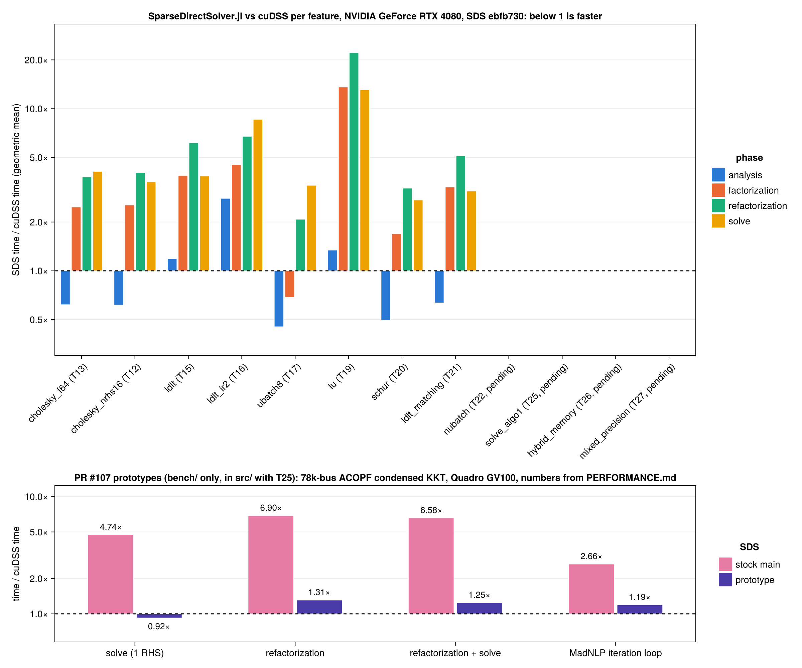

# cuDSS vs SparseDirectSolver.jl

Generated by `bench/compare_report.jl` from `bench/comparison/{cudss,sds}.csv` (`bench/compare.jl`). Times are BenchmarkTools medians per phase on a fresh solver; the ratio is SDS time / cuDSS time, so below 1 means SparseDirectSolver.jl is faster. Features whose task is not done in TASKS.md have blank SDS cells.

## Overview

Geometric mean of the SDS/cuDSS ratio over the matrices both solvers ran.

| feature | task | status | matrices | analysis | factorization | refactorization | solve |
| --- | --- | --- | --- | --- | --- | --- | --- |
| Cholesky, Float64 | T13 | done | 14 | 0.62× | 2.48× | 3.80× | 4.11× |
| Cholesky, 16 right-hand sides | T12 | done | 14 | 0.61× | 2.55× | 4.03× | 3.53× |
| LDLᵀ, static pivoting | T15 | done | 23 | 1.19× | 3.87× | 6.17× | 3.84× |
| LDLᵀ + 2 refinement steps, K2 dumps | T16 | done | 9 | 2.80× | 4.52× | 6.76× | 8.60× |
| Uniform batch of 8, Cholesky | T17 | done | 9 | 0.45× | 0.69× | 2.08× | 3.37× |
| LU, unsymmetric | T19 | done | 2 | 1.34× | 13.62× | 22.18× | 13.07× |
| Schur complement, Cholesky | T20 | done | 9 | 0.49× | 1.69× | 3.24× | 2.73× |
| LDLᵀ + matching (algo5), K2 dumps | T21 | done | 9 | 0.63× | 3.29× | 5.11× | 3.11× |
| Non-uniform batch, condensed dumps | T22 | pending |  |  |  |  |  |
| Partitioned-inverse solve (SDS algo1, cuDSS default) | T25 | pending |  |  |  |  |  |
| Hybrid memory mode | T26 | pending |  |  |  |  |  |
| Float32 factors, Float64 refinement | T27 | pending |  |  |  |  |  |

## PR #107 prototypes

Partitioned-inverse fused solve and split/segmented factorization prototyped in `bench/` (PR #107), not in `src/` yet (T25). 78k-bus ACOPF condensed KKT (n ≈ 6.7e5, Cholesky, native ND ordering), median of 20 warm runs, cuDSS 0.8.0 on the same device. The numbers are the PR's, quoted from `PERFORMANCE.md` ("Experiments 5–6 prototypes") into `prototype_pr107.csv`, not measured by `compare.jl`.

| metric | device | stock `main` ms | prototype ms | cuDSS ms | stock / cuDSS | prototype / cuDSS |
| --- | --- | --- | --- | --- | --- | --- |
| solve (1 RHS) | Quadro GV100 | 18.0 | 3.5 | 3.8 | 4.74× | 0.92× |
| refactorization | Quadro GV100 | 167.7 | 31.9 | 24.3 | 6.90× | 1.31× |
| refactorization + solve | Quadro GV100 | 185 | 35 | 28.1 | 6.58× | 1.25× |
| MadNLP iteration loop | Quadro GV100 | 26100 | 11700 | 9800 | 2.66× | 1.19× |
| solve (1 RHS) | Radeon VII | 20.5 | 8.05 | — |  |  |
| MadNLP iteration loop | Radeon VII | 63200 | 33900 | — |  |  |

## Cholesky, Float64

`cholesky_f64`, T13 (done), structure `SPD`, Float64, nrhs = 1.

| matrix | n | analysis cuDSS ms | SDS ms | ratio | factorization cuDSS ms | SDS ms | ratio | refactorization cuDSS ms | SDS ms | ratio | solve cuDSS ms | SDS ms | ratio | nnz(L) cuDSS | SDS | relres cuDSS | SDS |
| --- | --- | --- | --- | --- | --- | --- | --- | --- | --- | --- | --- | --- | --- | --- | --- | --- | --- |
| Boeing/bcsstk38 | 8032 | 38.2 | 53.5 | 1.40× | 3.77 | 23.6 | 6.24× | 2.37 | 23.5 | 9.91× | 0.525 | 2.01 | 3.83× | 7.99e+05 | 8.05e+05 | 2.25e-10 | 9.23e-11 |
| GHS_psdef/apache2 | 715176 | 4.29e+03 | 6.35e+03 | 1.48× | 464 | 1.14e+03 | 2.45× | 435 | 1.14e+03 | 2.62× | 6.86 | 82.6 | 12.05× | 1.45e+08 | 1.29e+08 | 1.8e-10 | 1.58e-10 |
| HB/bcsstk17 | 10974 | 43.7 | 65.1 | 1.49× | 3.9 | 29.4 | 7.55× | 2.44 | 29.9 | 12.22× | 0.662 | 3.79 | 5.72× | 1.08e+06 | 1.04e+06 | 4.52e-11 | 6.38e-11 |
| kkt_pglib_opf_case118_ieee_condensed_1 | 1088 | 13 | 4.82 | 0.37× | 0.992 | 1.25 | 1.26× | 0.438 | 0.971 | 2.22× | 0.256 | 0.904 | 3.53× | 1.52e+04 | 1.16e+04 | 7.26e-05 | 0.000128 |
| kkt_pglib_opf_case118_ieee_condensed_10 | 1088 | 12.3 | 5.07 | 0.41× | 1.02 | 0.973 | 0.95× | 0.53 | 0.945 | 1.78× | 0.261 | 0.777 | 2.98× | 1.52e+04 | 1.16e+04 | 1.4e-05 | 8.85e-06 |
| kkt_pglib_opf_case118_ieee_condensed_20 | 1088 | 12.8 | 5.09 | 0.40× | 1.06 | 1.01 | 0.95× | 0.351 | 0.983 | 2.80× | 0.257 | 0.985 | 3.84× | 1.52e+04 | 1.16e+04 | 0.293 | 0.0877 |
| kkt_pglib_opf_case1354_pegase_condensed_1 | 11192 | 54.2 | 55 | 1.02× | 1.35 | 3.44 | 2.54× | 0.585 | 3.3 | 5.64× | 0.269 | 1.46 | 5.44× | 1.55e+05 | 1.21e+05 | 0.000316 | 0.00026 |
| kkt_pglib_opf_case1354_pegase_condensed_10 | 11192 | 55.4 | 53.2 | 0.96× | 1.4 | 3.42 | 2.45× | 0.584 | 3.52 | 6.03× | 0.375 | 1.26 | 3.35× | 1.55e+05 | 1.21e+05 | 0.000142 | 9.99e-05 |
| kkt_pglib_opf_case1354_pegase_condensed_20 | 11192 | 55.4 | 55.5 | 1.00× | 1.39 | 3.55 | 2.54× | 0.685 | 3.17 | 4.63× | 0.387 | 1.31 | 3.37× | 1.55e+05 | 1.21e+05 | 7.94e-05 | 5.26e-05 |
| kkt_pglib_opf_case14_ieee_condensed_1 | 118 | 6.82 | 1.46 | 0.21× | 0.216 | 0.356 | 1.65× | 0.225 | 0.364 | 1.62× | 0.187 | 0.421 | 2.26× | 1.27e+03 | 1.03e+03 | 4.09e-07 | 1.3e-06 |
| kkt_pglib_opf_case14_ieee_condensed_10 | 118 | 6.77 | 0.971 | 0.14× | 0.221 | 0.387 | 1.75× | 0.212 | 0.407 | 1.92× | 0.195 | 0.413 | 2.12× | 1.27e+03 | 1.03e+03 | 0.000109 | 0.000172 |
| kkt_pglib_opf_case14_ieee_condensed_11 | 118 | 6.89 | 0.97 | 0.14× | 0.242 | 0.558 | 2.31× | 0.28 | 0.522 | 1.87× | 0.214 | 0.465 | 2.18× | 1.27e+03 | 1.03e+03 | 1.2e-05 | 1.56e-05 |
| lap2d_300 | 90000 | 269 | 367 | 1.36× | 5.99 | 32.7 | 5.46× | 3.96 | 32.9 | 8.29× | 0.675 | 3.48 | 5.16× | 2.43e+06 | 2.47e+06 | 1.84e-12 | 1.78e-12 |
| lap3d_40 | 64000 | 355 | 388 | 1.09× | 52.7 | 229 | 4.35× | 47.5 | 233 | 4.90× | 1.49 | 16.6 | 11.14× | 1.75e+07 | 1.44e+07 | 8.3e-14 | 7.47e-14 |

## Cholesky, 16 right-hand sides

`cholesky_nrhs16`, T12 (done), structure `SPD`, Float64, nrhs = 16.

| matrix | n | analysis cuDSS ms | SDS ms | ratio | factorization cuDSS ms | SDS ms | ratio | refactorization cuDSS ms | SDS ms | ratio | solve cuDSS ms | SDS ms | ratio | nnz(L) cuDSS | SDS | relres cuDSS | SDS |
| --- | --- | --- | --- | --- | --- | --- | --- | --- | --- | --- | --- | --- | --- | --- | --- | --- | --- |
| Boeing/bcsstk38 | 8032 | 38.5 | 53.4 | 1.39× | 3.66 | 25.1 | 6.86× | 2.34 | 25.1 | 10.71× | 0.85 | 3.47 | 4.09× | 7.99e+05 | 8.05e+05 | 6.3e-10 | 1.85e-10 |
| GHS_psdef/apache2 | 715176 | 4.44e+03 | 6.29e+03 | 1.42× | 465 | 1.16e+03 | 2.50× | 434 | 1.12e+03 | 2.58× | 28.9 | 272 | 9.42× | 1.45e+08 | 1.29e+08 | 1.83e-10 | 1.6e-10 |
| HB/bcsstk17 | 10974 | 43.4 | 66 | 1.52× | 3.89 | 30.9 | 7.94× | 2.33 | 30.9 | 13.28× | 0.764 | 6.16 | 8.06× | 1.08e+06 | 1.04e+06 | 5.14e-11 | 6.18e-11 |
| kkt_pglib_opf_case118_ieee_condensed_1 | 1088 | 11.8 | 5.1 | 0.43× | 0.911 | 1.03 | 1.13× | 0.341 | 1.01 | 2.96× | 0.375 | 0.965 | 2.57× | 1.52e+04 | 1.16e+04 | 6.7e-05 | 0.000135 |
| kkt_pglib_opf_case118_ieee_condensed_10 | 1088 | 11.9 | 5.06 | 0.43× | 0.882 | 1.05 | 1.19× | 0.406 | 1.03 | 2.54× | 0.346 | 0.865 | 2.50× | 1.52e+04 | 1.16e+04 | 1.52e-05 | 8.88e-06 |
| kkt_pglib_opf_case118_ieee_condensed_20 | 1088 | 12.2 | 4.89 | 0.40× | 0.889 | 0.975 | 1.10× | 0.359 | 0.949 | 2.64× | 0.26 | 0.813 | 3.12× | 1.52e+04 | 1.16e+04 | 0.492 | 0.223 |
| kkt_pglib_opf_case1354_pegase_condensed_1 | 11192 | 51.9 | 54.4 | 1.05× | 1.37 | 3.73 | 2.72× | 0.581 | 3.14 | 5.41× | 0.487 | 1.51 | 3.10× | 1.55e+05 | 1.21e+05 | 0.000394 | 0.000293 |
| kkt_pglib_opf_case1354_pegase_condensed_10 | 11192 | 52.9 | 52.2 | 0.99× | 1.5 | 3.43 | 2.30× | 0.614 | 3.42 | 5.58× | 0.457 | 1.63 | 3.56× | 1.55e+05 | 1.21e+05 | 0.000137 | 0.000103 |
| kkt_pglib_opf_case1354_pegase_condensed_20 | 11192 | 53.3 | 54.9 | 1.03× | 1.34 | 3.1 | 2.32× | 0.701 | 3.08 | 4.39× | 0.461 | 1.54 | 3.33× | 1.55e+05 | 1.21e+05 | 9.79e-05 | 6.83e-05 |
| kkt_pglib_opf_case14_ieee_condensed_1 | 118 | 7.25 | 1.01 | 0.14× | 0.199 | 0.404 | 2.03× | 0.24 | 0.495 | 2.06× | 0.221 | 0.509 | 2.30× | 1.27e+03 | 1.03e+03 | 6.35e-07 | 1.29e-06 |
| kkt_pglib_opf_case14_ieee_condensed_10 | 118 | 6.76 | 1.01 | 0.15× | 0.218 | 0.393 | 1.81× | 0.212 | 0.415 | 1.96× | 0.365 | 0.48 | 1.32× | 1.27e+03 | 1.03e+03 | 0.000179 | 0.000268 |
| kkt_pglib_opf_case14_ieee_condensed_11 | 118 | 6.84 | 1.05 | 0.15× | 0.24 | 0.373 | 1.55× | 0.222 | 0.367 | 1.66× | 0.261 | 0.502 | 1.92× | 1.27e+03 | 1.03e+03 | 3.34e-05 | 1.47e-05 |
| lap2d_300 | 90000 | 267 | 337 | 1.26× | 5.98 | 37.9 | 6.35× | 3.88 | 35.4 | 9.11× | 2.39 | 9.5 | 3.97× | 2.43e+06 | 2.47e+06 | 1.85e-12 | 1.79e-12 |
| lap3d_40 | 64000 | 355 | 401 | 1.13× | 53.2 | 246 | 4.63× | 47.7 | 245 | 5.13× | 6.01 | 53.4 | 8.88× | 1.75e+07 | 1.44e+07 | 8.98e-14 | 8.45e-14 |

## LDLᵀ, static pivoting

`ldlt`, T15 (done), structure `S`, Float64, nrhs = 1.

| matrix | n | analysis cuDSS ms | SDS ms | ratio | factorization cuDSS ms | SDS ms | ratio | refactorization cuDSS ms | SDS ms | ratio | solve cuDSS ms | SDS ms | ratio | nnz(L) cuDSS | SDS | relres cuDSS | SDS |
| --- | --- | --- | --- | --- | --- | --- | --- | --- | --- | --- | --- | --- | --- | --- | --- | --- | --- |
| Boeing/bcsstk38 | 8032 | 36.9 | 61 | 1.65× | 4.58 | 40.5 | 8.85× | 3.24 | 40.4 | 12.49× | 0.479 | 2.14 | 4.46× | 7.99e+05 | 8.05e+05 | 7.32e-11 | 1.77e-10 |
| GHS_psdef/apache2 | 715176 | 4.46e+03 | 6.43e+03 | 1.44× | 524 | 2.06e+03 | 3.94× | 493 | 2.1e+03 | 4.25× | 6.75 | 100 | 14.86× | 1.45e+08 | 1.29e+08 | 1.58e-10 | 1.42e-10 |
| HB/bcsstk17 | 10974 | 43.4 | 74 | 1.71× | 4.85 | 49.8 | 10.27× | 3.35 | 49.9 | 14.88× | 0.472 | 3.84 | 8.14× | 1.08e+06 | 1.04e+06 | 4.2e-11 | 3.41e-11 |
| kkt_pglib_opf_case118_ieee_condensed_1 | 1088 | 12.2 | 5.27 | 0.43× | 1.07 | 1.9 | 1.78× | 0.446 | 1.88 | 4.21× | 0.284 | 0.752 | 2.65× | 1.52e+04 | 1.16e+04 | 4.21e-05 | 4.3e-05 |
| kkt_pglib_opf_case118_ieee_condensed_10 | 1088 | 12.2 | 5.66 | 0.46× | 1.09 | 1.84 | 1.69× | 0.433 | 1.82 | 4.20× | 0.368 | 0.746 | 2.02× | 1.52e+04 | 1.16e+04 | 1.05e-05 | 1.14e-05 |
| kkt_pglib_opf_case118_ieee_condensed_20 | 1088 | 12.5 | 5.29 | 0.42× | 1.1 | 1.88 | 1.71× | 0.423 | 1.88 | 4.44× | 0.334 | 1.03 | 3.10× | 1.52e+04 | 1.16e+04 | 0.0953 | 0.0833 |
| kkt_pglib_opf_case118_ieee_k2_1 | 3150 | 16.3 | 55 | 3.37× | 1.01 | 1.77 | 1.75× | 0.431 | 1.79 | 4.14× | 0.368 | 0.846 | 2.30× | 2.02e+04 | 2.1e+04 | 1.88 | 0.22 |
| kkt_pglib_opf_case118_ieee_k2_10 | 3150 | 17.3 | 55.9 | 3.23× | 0.979 | 1.73 | 1.77× | 0.423 | 1.75 | 4.15× | 0.378 | 0.916 | 2.42× | 2.02e+04 | 2.05e+04 | 6.76 | 0.0122 |
| kkt_pglib_opf_case118_ieee_k2_20 | 3150 | 16.2 | 55.7 | 3.43× | 1.02 | 1.74 | 1.71× | 0.399 | 1.73 | 4.34× | 0.27 | 0.85 | 3.15× | 2.02e+04 | 2.05e+04 | 8.45 | 0.0295 |
| kkt_pglib_opf_case1354_pegase_condensed_1 | 11192 | 54 | 55.4 | 1.03× | 1.45 | 7.23 | 4.97× | 0.73 | 7.23 | 9.91× | 0.303 | 1.23 | 4.06× | 1.55e+05 | 1.21e+05 | 0.000343 | 0.000295 |
| kkt_pglib_opf_case1354_pegase_condensed_10 | 11192 | 54.7 | 54.7 | 1.00× | 1.57 | 7.32 | 4.68× | 0.648 | 7.34 | 11.33× | 0.418 | 1.21 | 2.89× | 1.55e+05 | 1.21e+05 | 0.000128 | 9.71e-05 |
| kkt_pglib_opf_case1354_pegase_condensed_20 | 11192 | 54.4 | 56.6 | 1.04× | 1.46 | 7.81 | 5.37× | 0.652 | 7.81 | 11.98× | 0.399 | 1.41 | 3.54× | 1.55e+05 | 1.21e+05 | 7.92e-05 | 4.75e-05 |
| kkt_pglib_opf_case1354_pegase_k2_1 | 33811 | 96.8 | 1.02e+03 | 10.57× | 1.58 | 12.2 | 7.73× | 0.794 | 12.5 | 15.78× | 0.471 | 1.97 | 4.17× | 2.02e+05 | 2.16e+05 | 72.4 | 17.9 |
| kkt_pglib_opf_case1354_pegase_k2_10 | 33811 | 95.9 | 1.09e+03 | 11.38× | 1.59 | 7.24 | 4.57× | 0.823 | 18.4 | 22.38× | 0.455 | 2.59 | 5.69× | 2.02e+05 | 2.2e+05 | 48.1 | 70 |
| kkt_pglib_opf_case1354_pegase_k2_20 | 33811 | 95.9 | 1.08e+03 | 11.24× | 1.57 | 18.9 | 12.05× | 0.799 | 10.7 | 13.37× | 0.44 | 2.45 | 5.57× | 2.02e+05 | 2.21e+05 | 100 | 26.2 |
| kkt_pglib_opf_case14_ieee_condensed_1 | 118 | 6.84 | 1.49 | 0.22× | 0.258 | 0.678 | 2.63× | 0.334 | 0.566 | 1.69× | 0.233 | 0.584 | 2.51× | 1.27e+03 | 1.03e+03 | 5.24e-07 | 1.17e-06 |
| kkt_pglib_opf_case14_ieee_condensed_10 | 118 | 7.22 | 1.91 | 0.26× | 0.236 | 0.59 | 2.50× | 0.32 | 0.53 | 1.66× | 0.34 | 0.526 | 1.55× | 1.27e+03 | 1.03e+03 | 0.000104 | 0.000139 |
| kkt_pglib_opf_case14_ieee_condensed_11 | 118 | 7.34 | 1.33 | 0.18× | 0.201 | 0.56 | 2.79× | 0.201 | 0.637 | 3.17× | 0.23 | 0.497 | 2.16× | 1.27e+03 | 1.03e+03 | 1.32e-05 | 1.13e-05 |
| kkt_pglib_opf_case14_ieee_k2_1 | 344 | 7.69 | 4.59 | 0.60× | 0.223 | 0.863 | 3.86× | 0.31 | 1.03 | 3.32× | 0.224 | 0.929 | 4.15× | 2.02e+03 | 2.14e+03 | 0.189 | 7.68e-09 |
| kkt_pglib_opf_case14_ieee_k2_10 | 344 | 7.49 | 6.01 | 0.80× | 0.201 | 0.826 | 4.11× | 0.193 | 0.938 | 4.87× | 0.326 | 1.14 | 3.51× | 2.02e+03 | 2.15e+03 | 0.219 | 1.18e-05 |
| kkt_pglib_opf_case14_ieee_k2_15 | 344 | 7.74 | 3.11 | 0.40× | 0.215 | 1.16 | 5.37× | 0.209 | 1.17 | 5.60× | 0.196 | 0.602 | 3.07× | 2.02e+03 | 3.27e+03 | 0.245 | 0.307 |
| lap2d_300 | 90000 | 264 | 327 | 1.24× | 7.12 | 42.7 | 5.99× | 5.19 | 43.1 | 8.31× | 0.689 | 4.03 | 5.85× | 2.43e+06 | 2.47e+06 | 1.61e-12 | 1.59e-12 |
| lap3d_40 | 64000 | 351 | 404 | 1.15× | 63.6 | 435 | 6.84× | 58.5 | 439 | 7.50× | 1.39 | 20.4 | 14.74× | 1.75e+07 | 1.44e+07 | 7.66e-14 | 6.25e-14 |

## LDLᵀ + 2 refinement steps, K2 dumps

`ldlt_ir2`, T16 (done), structure `S`, Float64, nrhs = 1.

| matrix | n | analysis cuDSS ms | SDS ms | ratio | factorization cuDSS ms | SDS ms | ratio | refactorization cuDSS ms | SDS ms | ratio | solve cuDSS ms | SDS ms | ratio | nnz(L) cuDSS | SDS | relres cuDSS | SDS |
| --- | --- | --- | --- | --- | --- | --- | --- | --- | --- | --- | --- | --- | --- | --- | --- | --- | --- |
| kkt_pglib_opf_case118_ieee_k2_1 | 3150 | 15.8 | 60.8 | 3.85× | 1.02 | 2.12 | 2.08× | 0.342 | 1.88 | 5.51× | 0.552 | 4.67 | 8.46× | 2.02e+04 | 2.1e+04 | 0.00447 | 5.09e-09 |
| kkt_pglib_opf_case118_ieee_k2_10 | 3150 | 16.5 | 59.2 | 3.60× | 1.01 | 1.76 | 1.74× | 0.384 | 1.77 | 4.60× | 0.927 | 4.33 | 4.67× | 2.02e+04 | 2.05e+04 | 0.176 | 7.69e-09 |
| kkt_pglib_opf_case118_ieee_k2_20 | 3150 | 16.1 | 59.2 | 3.67× | 1.04 | 1.77 | 1.70× | 0.414 | 2.22 | 5.37× | 0.952 | 4.57 | 4.80× | 2.02e+04 | 2.05e+04 | 0.391 | 4.09e-09 |
| kkt_pglib_opf_case1354_pegase_k2_1 | 33811 | 100 | 1.08e+03 | 10.83× | 1.61 | 19.9 | 12.38× | 0.858 | 20.6 | 23.99× | 0.827 | 26.9 | 32.52× | 2.02e+05 | 2.16e+05 | 1.58 | 0.0289 |
| kkt_pglib_opf_case1354_pegase_k2_10 | 33811 | 101 | 1.15e+03 | 11.39× | 1.59 | 26.8 | 16.84× | 0.827 | 10.7 | 12.88× | 0.924 | 26.6 | 28.77× | 2.02e+05 | 2.2e+05 | 2.37 | 11.4 |
| kkt_pglib_opf_case1354_pegase_k2_20 | 33811 | 98.4 | 1.15e+03 | 11.66× | 1.6 | 29.7 | 18.50× | 0.877 | 17.3 | 19.74× | 1.01 | 27.4 | 27.17× | 2.02e+05 | 2.21e+05 | 70.5 | 0.195 |
| kkt_pglib_opf_case14_ieee_k2_1 | 344 | 7.91 | 4.49 | 0.57× | 0.318 | 0.766 | 2.40× | 0.256 | 0.721 | 2.81× | 0.505 | 1.81 | 3.59× | 2.02e+03 | 2.14e+03 | 2.72e-06 | 6.15e-13 |
| kkt_pglib_opf_case14_ieee_k2_10 | 344 | 7.85 | 5.48 | 0.70× | 0.211 | 0.726 | 3.44× | 0.313 | 0.824 | 2.63× | 0.696 | 2.51 | 3.61× | 2.02e+03 | 2.15e+03 | 1.74e-06 | 2.64e-14 |
| kkt_pglib_opf_case14_ieee_k2_15 | 344 | 8.12 | 2.99 | 0.37× | 0.267 | 1.06 | 3.96× | 0.224 | 1.08 | 4.82× | 0.682 | 2.81 | 4.11× | 2.02e+03 | 3.27e+03 | 1.69e-06 | 6.19e-09 |

## Uniform batch of 8, Cholesky

`ubatch8`, T17 (done), structure `SPD`, Float64, nrhs = 1, uniform batch of 8.

| matrix | n | analysis cuDSS ms | SDS ms | ratio | factorization cuDSS ms | SDS ms | ratio | refactorization cuDSS ms | SDS ms | ratio | solve cuDSS ms | SDS ms | ratio | nnz(L) cuDSS | SDS | relres cuDSS | SDS |
| --- | --- | --- | --- | --- | --- | --- | --- | --- | --- | --- | --- | --- | --- | --- | --- | --- | --- |
| kkt_pglib_opf_case118_ieee_condensed_1 | 1088 | 12.9 | 5.78 | 0.45× | 1.93 | 1 | 0.52× | 0.511 | 1.06 | 2.08× | 0.403 | 2.78 | 6.91× | 1.52e+04 | 1.16e+04 | 3.6e-05 | 5.79e-05 |
| kkt_pglib_opf_case118_ieee_condensed_10 | 1088 | 12 | 6.05 | 0.50× | 1.9 | 1.03 | 0.54× | 0.546 | 1.05 | 1.93× | 0.279 | 1.18 | 4.23× | 1.52e+04 | 1.16e+04 | 1.63e-05 | 6.65e-06 |
| kkt_pglib_opf_case118_ieee_condensed_20 | 1088 | 11.8 | 5.55 | 0.47× | 1.9 | 1.05 | 0.55× | 0.65 | 1.32 | 2.02× | 0.361 | 1.51 | 4.18× | 1.52e+04 | 1.16e+04 | 0.215 | 0.0874 |
| kkt_pglib_opf_case1354_pegase_condensed_1 | 11192 | 51.6 | 57.5 | 1.11× | 4.11 | 3.84 | 0.94× | 1.62 | 3.87 | 2.38× | 0.524 | 1.39 | 2.66× | 1.55e+05 | 1.21e+05 | 0.000343 | 0.000277 |
| kkt_pglib_opf_case1354_pegase_condensed_10 | 11192 | 52.4 | 57.9 | 1.10× | 3.98 | 3.9 | 0.98× | 1.61 | 3.99 | 2.48× | 0.557 | 2.3 | 4.12× | 1.55e+05 | 1.21e+05 | 0.000138 | 9.97e-05 |
| kkt_pglib_opf_case1354_pegase_condensed_20 | 11192 | 51.8 | 56 | 1.08× | 3.97 | 4.11 | 1.03× | 1.6 | 3.82 | 2.38× | 0.532 | 1.38 | 2.60× | 1.55e+05 | 1.21e+05 | 6.51e-05 | 4.99e-05 |
| kkt_pglib_opf_case14_ieee_condensed_1 | 118 | 6.88 | 1.23 | 0.18× | 0.98 | 0.801 | 0.82× | 0.231 | 0.398 | 1.72× | 0.173 | 0.601 | 3.47× | 1.27e+03 | 1.03e+03 | 7.72e-07 | 9.03e-07 |
| kkt_pglib_opf_case14_ieee_condensed_10 | 118 | 6.79 | 1.12 | 0.17× | 0.943 | 0.509 | 0.54× | 0.222 | 0.407 | 1.84× | 0.337 | 0.422 | 1.25× | 1.27e+03 | 1.03e+03 | 0.000123 | 7.74e-05 |
| kkt_pglib_opf_case14_ieee_condensed_11 | 118 | 7.02 | 1.31 | 0.19× | 0.942 | 0.489 | 0.52× | 0.214 | 0.437 | 2.04× | 0.267 | 0.995 | 3.73× | 1.27e+03 | 1.03e+03 | 5.34e-06 | 6.91e-06 |

## LU, unsymmetric

`lu`, T19 (done), structure `G`, Float64, nrhs = 1.

| matrix | n | analysis cuDSS ms | SDS ms | ratio | factorization cuDSS ms | SDS ms | ratio | refactorization cuDSS ms | SDS ms | ratio | solve cuDSS ms | SDS ms | ratio | nnz(L) cuDSS | SDS | relres cuDSS | SDS |
| --- | --- | --- | --- | --- | --- | --- | --- | --- | --- | --- | --- | --- | --- | --- | --- | --- | --- |
| Rajat/rajat21 | 411676 | 1.88e+03 | 3e+03 | 1.60× | 33.7 | 624 | 18.54× | 31.2 | 584 | 18.72× | 2.17 | 24.6 | 11.32× | 6.89e+06 | 2.37e+06 | 2.28e+08 | 4.3e+03 |
| TSOPF/TSOPF_RS_b39_c7 | 14098 | 89.9 | 102 | 1.13× | 2.72 | 27.2 | 10.01× | 1.04 | 27.4 | 26.28× | 0.389 | 5.88 | 15.10× | 1.47e+06 | 5.22e+05 | 3.37e+29 | 20.3 |

## Schur complement, Cholesky

`schur`, T20 (done), structure `SPD`, Float64, nrhs = 1.

| matrix | n | analysis cuDSS ms | SDS ms | ratio | factorization cuDSS ms | SDS ms | ratio | refactorization cuDSS ms | SDS ms | ratio | solve cuDSS ms | SDS ms | ratio | nnz(L) cuDSS | SDS | relres cuDSS | SDS |
| --- | --- | --- | --- | --- | --- | --- | --- | --- | --- | --- | --- | --- | --- | --- | --- | --- | --- |
| kkt_pglib_opf_case118_ieee_condensed_1 | 1088 | 12.3 | 5.97 | 0.49× | 1.11 | 1.2 | 1.08× | 0.425 | 1.17 | 2.76× | 0.318 | 0.455 | 1.43× | 1.96e+04 | 1.85e+04 |  |  |
| kkt_pglib_opf_case118_ieee_condensed_10 | 1088 | 12 | 5.41 | 0.45× | 1.08 | 1.31 | 1.22× | 0.481 | 1.48 | 3.07× | 0.267 | 0.615 | 2.30× | 1.96e+04 | 1.85e+04 |  |  |
| kkt_pglib_opf_case118_ieee_condensed_20 | 1088 | 12 | 5.63 | 0.47× | 1.1 | 1.17 | 1.06× | 0.386 | 1.74 | 4.52× | 0.175 | 0.533 | 3.04× | 1.96e+04 | 1.85e+04 |  |  |
| kkt_pglib_opf_case1354_pegase_condensed_1 | 11192 | 55.5 | 59.9 | 1.08× | 1.51 | 4 | 2.64× | 0.731 | 3.85 | 5.27× | 0.323 | 0.826 | 2.56× | 1.65e+05 | 1.31e+05 |  |  |
| kkt_pglib_opf_case1354_pegase_condensed_10 | 11192 | 56 | 61.3 | 1.09× | 1.51 | 4.46 | 2.96× | 0.688 | 4 | 5.81× | 0.316 | 1.92 | 6.09× | 1.65e+05 | 1.31e+05 |  |  |
| kkt_pglib_opf_case1354_pegase_condensed_20 | 11192 | 54.5 | 61.2 | 1.12× | 1.46 | 3.99 | 2.72× | 0.863 | 4.06 | 4.70× | 0.336 | 1.12 | 3.35× | 1.65e+05 | 1.31e+05 |  |  |
| kkt_pglib_opf_case14_ieee_condensed_1 | 118 | 7.23 | 1.95 | 0.27× | 0.364 | 0.457 | 1.25× | 0.271 | 0.487 | 1.80× | 0.167 | 0.546 | 3.27× | 1.51e+03 | 1.3e+03 |  |  |
| kkt_pglib_opf_case14_ieee_condensed_10 | 118 | 7.44 | 1.6 | 0.22× | 0.261 | 0.538 | 2.06× | 0.356 | 0.775 | 2.17× | 0.176 | 0.413 | 2.35× | 1.51e+03 | 1.3e+03 |  |  |
| kkt_pglib_opf_case14_ieee_condensed_11 | 118 | 7.26 | 1.63 | 0.22× | 0.348 | 0.521 | 1.50× | 0.353 | 0.639 | 1.81× | 0.239 | 0.505 | 2.11× | 1.51e+03 | 1.3e+03 |  |  |

## LDLᵀ + matching (algo5), K2 dumps

`ldlt_matching`, T21 (done), structure `S`, Float64, nrhs = 1.

| matrix | n | analysis cuDSS ms | SDS ms | ratio | factorization cuDSS ms | SDS ms | ratio | refactorization cuDSS ms | SDS ms | ratio | solve cuDSS ms | SDS ms | ratio | nnz(L) cuDSS | SDS | relres cuDSS | SDS |
| --- | --- | --- | --- | --- | --- | --- | --- | --- | --- | --- | --- | --- | --- | --- | --- | --- | --- |
| kkt_pglib_opf_case118_ieee_k2_1 | 3150 | 21.8 | 14.3 | 0.66× | 1.23 | 2.57 | 2.08× | 0.629 | 2.59 | 4.13× | 0.339 | 1.16 | 3.42× | 7.38e+04 | 3.59e+04 | 3.96e-12 | 4.01e-12 |
| kkt_pglib_opf_case118_ieee_k2_10 | 3150 | 21.8 | 15.4 | 0.71× | 1.2 | 2.59 | 2.16× | 0.474 | 2.49 | 5.26× | 0.247 | 1.35 | 5.47× | 7.1e+04 | 3.47e+04 | 5.55e-13 | 5.94e-13 |
| kkt_pglib_opf_case118_ieee_k2_20 | 3150 | 22 | 15.8 | 0.72× | 1.3 | 2.79 | 2.16× | 0.584 | 3.01 | 5.15× | 0.254 | 1.81 | 7.13× | 6.85e+04 | 3.42e+04 | 3.44e-13 | 3.07e-13 |
| kkt_pglib_opf_case1354_pegase_k2_1 | 33811 | 133 | 179 | 1.34× | 2.16 | 11.8 | 5.45× | 1.21 | 11.6 | 9.64× | 0.538 | 2.48 | 4.61× | 7.23e+05 | 3.68e+05 | 0.00308 | 0.000311 |
| kkt_pglib_opf_case1354_pegase_k2_10 | 33811 | 137 | 178 | 1.30× | 2.39 | 14.1 | 5.90× | 1.35 | 11.4 | 8.41× | 0.431 | 1.79 | 4.15× | 7.31e+05 | 3.65e+05 | 0.00818 | 4.11e-05 |
| kkt_pglib_opf_case1354_pegase_k2_20 | 33811 | 141 | 191 | 1.36× | 2.17 | 10.3 | 4.75× | 1.18 | 10.5 | 8.89× | 0.479 | 1.64 | 3.42× | 7.23e+05 | 3.63e+05 | 0.00813 | 0.00069 |
| kkt_pglib_opf_case14_ieee_k2_1 | 344 | 9.23 | 2.47 | 0.27× | 0.348 | 1.12 | 3.21× | 0.307 | 1.09 | 3.55× | 0.338 | 0.524 | 1.55× | 7.26e+03 | 3.65e+03 | 7.9e-13 | 1.03e-12 |
| kkt_pglib_opf_case14_ieee_k2_10 | 344 | 8.55 | 2.54 | 0.30× | 0.39 | 0.878 | 2.25× | 0.41 | 0.976 | 2.38× | 0.35 | 0.535 | 1.53× | 6.93e+03 | 3.53e+03 | 5.22e-14 | 5.37e-14 |
| kkt_pglib_opf_case14_ieee_k2_15 | 344 | 8.91 | 2.32 | 0.26× | 0.281 | 1.19 | 4.25× | 0.309 | 1.08 | 3.48× | 0.379 | 0.501 | 1.32× | 6.93e+03 | 3.53e+03 | 3.82e-14 | 4.78e-14 |

## Non-uniform batch, condensed dumps

`nubatch`, T22 (pending), structure `SPD`, Float64, nrhs = 1.

| matrix | n | analysis cuDSS ms | SDS ms | ratio | factorization cuDSS ms | SDS ms | ratio | refactorization cuDSS ms | SDS ms | ratio | solve cuDSS ms | SDS ms | ratio | nnz(L) cuDSS | SDS | relres cuDSS | SDS |
| --- | --- | --- | --- | --- | --- | --- | --- | --- | --- | --- | --- | --- | --- | --- | --- | --- | --- |
| batch_of_9 | 37194 | 129 |  |  | 2.01 |  |  | 0.95 |  |  | 0.427 |  |  | 5.12e+05 |  | 0.186 |  |

## Partitioned-inverse solve (SDS algo1, cuDSS default)

`solve_algo1`, T25 (pending), structure `SPD`, Float64, nrhs = 1.

| matrix | n | analysis cuDSS ms | SDS ms | ratio | factorization cuDSS ms | SDS ms | ratio | refactorization cuDSS ms | SDS ms | ratio | solve cuDSS ms | SDS ms | ratio | nnz(L) cuDSS | SDS | relres cuDSS | SDS |
| --- | --- | --- | --- | --- | --- | --- | --- | --- | --- | --- | --- | --- | --- | --- | --- | --- | --- |
| Boeing/bcsstk38 | 8032 | 36.8 |  |  | 3.66 |  |  | 2.28 |  |  | 0.518 |  |  | 7.99e+05 |  | 2.33e-10 |  |
| GHS_psdef/apache2 | 715176 | 4.47e+03 |  |  | 463 |  |  | 418 |  |  | 6.54 |  |  | 1.45e+08 |  | 1.8e-10 |  |
| HB/bcsstk17 | 10974 | 43.9 |  |  | 3.86 |  |  | 2.32 |  |  | 0.459 |  |  | 1.08e+06 |  | 4.18e-11 |  |
| kkt_pglib_opf_case118_ieee_condensed_1 | 1088 | 11.8 |  |  | 0.89 |  |  | 0.385 |  |  | 0.243 |  |  | 1.52e+04 |  | 3.45e-05 |  |
| kkt_pglib_opf_case118_ieee_condensed_10 | 1088 | 11.8 |  |  | 0.908 |  |  | 0.345 |  |  | 0.249 |  |  | 1.52e+04 |  | 1.17e-05 |  |
| kkt_pglib_opf_case118_ieee_condensed_20 | 1088 | 11.6 |  |  | 0.859 |  |  | 0.392 |  |  | 0.24 |  |  | 1.52e+04 |  | 0.375 |  |
| kkt_pglib_opf_case1354_pegase_condensed_1 | 11192 | 54.6 |  |  | 1.33 |  |  | 0.754 |  |  | 0.29 |  |  | 1.55e+05 |  | 0.000307 |  |
| kkt_pglib_opf_case1354_pegase_condensed_10 | 11192 | 57.4 |  |  | 1.43 |  |  | 0.595 |  |  | 0.339 |  |  | 1.55e+05 |  | 0.00014 |  |
| kkt_pglib_opf_case1354_pegase_condensed_20 | 11192 | 54.1 |  |  | 1.33 |  |  | 0.736 |  |  | 0.335 |  |  | 1.55e+05 |  | 7.78e-05 |  |
| kkt_pglib_opf_case14_ieee_condensed_1 | 118 | 7.07 |  |  | 0.267 |  |  | 0.217 |  |  | 0.356 |  |  | 1.27e+03 |  | 6.85e-07 |  |
| kkt_pglib_opf_case14_ieee_condensed_10 | 118 | 7.17 |  |  | 0.224 |  |  | 0.224 |  |  | 0.345 |  |  | 1.27e+03 |  | 0.000103 |  |
| kkt_pglib_opf_case14_ieee_condensed_11 | 118 | 6.96 |  |  | 0.223 |  |  | 0.217 |  |  | 0.264 |  |  | 1.27e+03 |  | 1.11e-05 |  |
| lap2d_300 | 90000 | 276 |  |  | 5.9 |  |  | 4.03 |  |  | 0.675 |  |  | 2.43e+06 |  | 1.84e-12 |  |
| lap3d_40 | 64000 | 356 |  |  | 52.7 |  |  | 47.2 |  |  | 1.43 |  |  | 1.75e+07 |  | 8.31e-14 |  |

## Hybrid memory mode

`hybrid_memory`, T26 (pending), structure `SPD`, Float64, nrhs = 1.

| matrix | n | analysis cuDSS ms | SDS ms | ratio | factorization cuDSS ms | SDS ms | ratio | refactorization cuDSS ms | SDS ms | ratio | solve cuDSS ms | SDS ms | ratio | nnz(L) cuDSS | SDS | relres cuDSS | SDS |
| --- | --- | --- | --- | --- | --- | --- | --- | --- | --- | --- | --- | --- | --- | --- | --- | --- | --- |
| GHS_psdef/apache2 | 715176 | 4.4e+03 |  |  | 447 |  |  | 417 |  |  | 6.51 |  |  | 1.45e+08 |  | 1.8e-10 |  |
| kkt_pglib_opf_case1354_pegase_condensed_1 | 11192 | 53.2 |  |  | 1.4 |  |  | 0.614 |  |  | 0.328 |  |  | 1.55e+05 |  | 0.000291 |  |
| kkt_pglib_opf_case1354_pegase_condensed_10 | 11192 | 54.7 |  |  | 1.41 |  |  | 0.593 |  |  | 0.452 |  |  | 1.55e+05 |  | 0.000147 |  |
| kkt_pglib_opf_case1354_pegase_condensed_20 | 11192 | 52 |  |  | 1.32 |  |  | 0.779 |  |  | 0.341 |  |  | 1.55e+05 |  | 7.14e-05 |  |

## Float32 factors, Float64 refinement

`mixed_precision`, T27 (pending), structure `SPD`, Float64, nrhs = 1, no cuDSS counterpart.

Not run yet.

## Runs

* cuDSS 0.8.0 on NVIDIA GeForce RTX 4080, repository 00e6e4e, 2026-10-07.
* cuDSS 0.8.0 on NVIDIA GeForce RTX 4080, repository 57e2ea9+dirty, 2026-10-02.
* cuDSS 0.8.0 on NVIDIA GeForce RTX 4080, repository 00e6e4e+dirty, 2026-10-07.
* SparseDirectSolver.jl 0.1.0 on NVIDIA GeForce RTX 4080, repository ebfb730, 2026-10-09.
